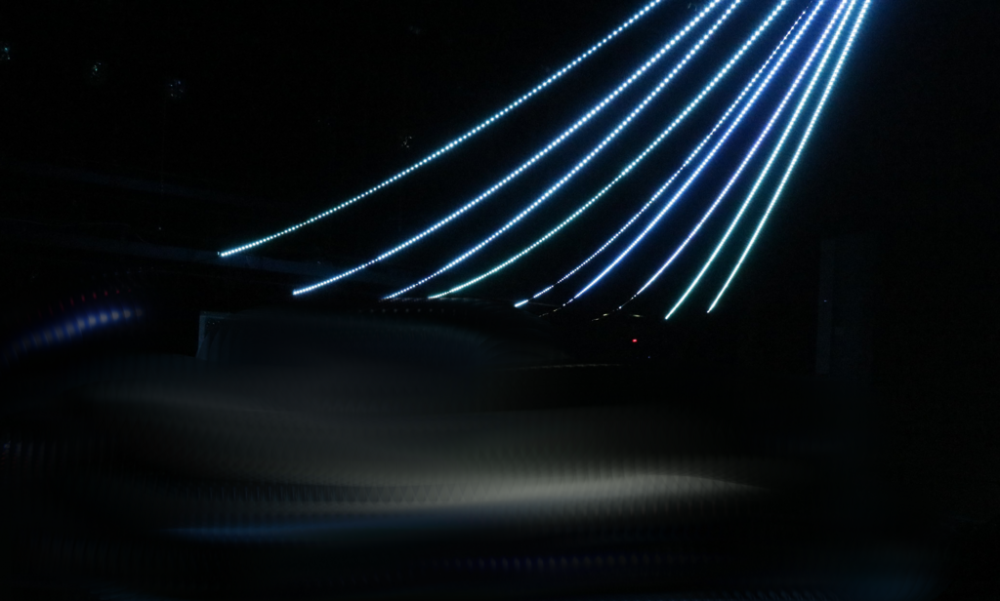
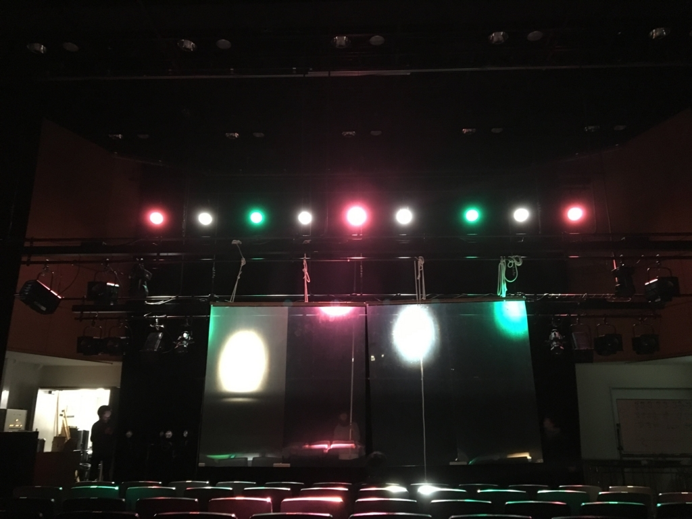

イベントレポ。自分は途中から企画に参加した、今回はプロマネ兼システム構築としての参加でした。

ここでは照明・音響・映像周りのシステムについてのメモ

# 照明

今回の照明周りの機材

「前回よりも良いものを」ということで前回の反省を踏まえて今回挑戦したことです。

* 事前プログラミングによる照明の自動制御と照明と映像の同期
* 電飾を用いた立体的な演出
* 生バンド演奏によるライブ
* プロジェクター2台同時投影

## 事前プログラミングによる照明の自動制御と照明と映像の同期

第一回はパレータスSXで手動でオペして、ボーカロイド楽曲の速いテンポにオペレーターが付いて行けずいっぱいいっぱいだったので、2回目は自動化を導入。2回目では映像の再生ボタンと照明の再生ボタンをせーので押す方法で同期していた。今回3回目では2台のプロジェクターも含め3系統のタイミングを合わせる必要があったため手動の再生からArt-Netで再生を行うように変更。

QLC+からArt-Netを通じてVDMX5へ信号を流し、VDMX5で指定の信号を受信したら再生するように設定をしておく。VDMX5の詳細は別記事で書く予定。
企画段階ではプロジェクターが3台以上で、MMDのダンスの映像に加えホリゾントにも背景となる映像を投影し、照明に映像を加えた演出をしたいなど、色々な話が出ていたので。Midi・SMPTタイムコード・OSCなどの方法も検討したが、フレキシブルなシステム構築を目指しArt-Netでの同期を選んだ。
今回のイベントでは工数とスケジュールの関係やらなんやらで背景への映像投影のアイディアは次回以降のイベントに持ち越しにし、MMDの映像を舞台の上・下手から同時投影するのみとなった、今回はたまたま業務用のスイッチングハブを使うことができたのでパケットロス等のリスク対策は講じなかったが大事をとるならArt-NetではなくHDMIスプリッターなどで分岐した方がレイテンシ調整とかもしなくて良かったなーと終わってから思った。

今回のイベントでは14の楽曲を使用するため、1人で照明の打ち込みを行うのはスケジュール的にもキツキツだったし、これでは1人のスタッフしか経験や成長ができないということでどうにかして複数人で打ち込みができないかと模索。複数人のオペレータで分担して打ち込みの宿題を出した。QLC+には2つのプロジェクトデータを結合する機能は付いていないので他のソフトウェアを使用することも検討したが、スタッフ達のQLC＋の導入期に他のソフトを覚えさせるのはラーニングコストが高いし、混乱を招くだろうと思いQLC+で行うことにした。プロジェクトデータ含めQLC+関連のデータは殆どがXMLファイルなのでマージ用のツールを作り、マージすることにした。この詳細も別記事で。
最終的には4人で14曲のデータを作成した。作成のフローはこんなかんじ。

1. フィクスチャーリストファイルを作成
2. 1で作成したフィクスチャーリストファイルを読み込み、プロジェクトデータを作成する
3. QLC+の"タイムライン"を使用して照明を打ち込む
4. 14曲分のデータを作成したら、回収し、自作したマージツールで1つにする

この期間が短い中でマージツールを作って、マージしてなので作業にかなりの工数を割いた、予想外の連続でうげーって言いながら作業してました。
この時に照明はQLC＋のUniverse 1を使用し、OUTPUTはOPEN DMX USB互換品から１本DMX512-Aを出力し照明の制御を、QLC+のUniverse 2 のOUTPUTにはArt-Netで映像の再生のタイミングで信号を送信するように設定した。Universe2の1chにフィクスチャーのGeneric Dimmerを指定しておけばファンクションを作成できるので、そのファンクションをタイムライン上に配置すればOK

再生はQLC+のタイムラインのスタートをクリックするだけ、最後までほっとけばOK。楽チン！！

## 電飾を用いた立体的な演出

スクリーンへプロジェクターで投影していることから、プロジェクターよりも強い光をスクリーンの後ろに出すことができなかったので、後ろがダメなら前に出そうということでほぼ全ての灯体を客席頭上にむけ、さらに電飾も加えて迫り出してくるような照明を目指したつもり。

使ったのはAmazonで購入した5mのLEDストリップライトを5M x 10本、メータ単価100円ぐらいなので5000円ぐらいです、でもこれだけじゃ光らないので別途Dimmerを用意する必要があります。今回使ったのはRGBと共通の＋の4極をもつ12Vタイプで１本でRGBの3chをDMXで制御できれば良いです。秋月電子とかAmazonとかでも既製品のディマーが購入可能ですが、このDimmerがLEDよりも高い。今回は他のところにお金を回したかったので、自作して節約しました。30系統12Vで10000円ぐらいで作成できました。Arduino使えばDMXは簡単に扱えるので適当にプログラムを書き、ハードを適当に作ればいいです。４轍ぐらいかかった。

今回このDimmerは1本あたりDMXをRed,Greed,Blue,Dim,Stroboの5ch消費するので、電飾だけで50chも食う大食らいです。作成レポは別記事

やってみてわかったのが、以外と光量が強いこと。単体でピカピカしている分にはいいんですけど、10本もまとめて光ってるとかなりやかましい感じに。体感クリスマスのイルミネーションの1.5倍くらい眩しいです。さらに、LEDとはいえ１本で12V 3A消費するので1分程光らせるとテープが熱を持ち、12Vの変圧器のファンが勢い良く回り出します。LEDを伸ばさずに巻いたまま使うのはちょっと怖い。		

## 生バンド演奏によるライブ

今回のライブは2部構成になってて、１部はMMDのみのライブ、2部からはVo初音ミク・Gt1,2・Dr・Baの生演奏・SE制作をお願いしました。
システムは単純で、MMDの動画のスレテオの音声のLを初音ミクで作成した音声のみにしMainSPへ、Rにはテンポを合わせるためのクリック音を入れ演者のイヤモニへ送ります。単純なシステムですが本番ではMMDの動画データに埋め込む必要があり、作業が並行して進められないことなどにより工数が予測しづらい作業です。

1. VOCALOID・初音ミクを使用し、Vo音声データを作成
2. Vo音声データを元にDAWなどでクリック音やSEを作成し、LRに割り振った音声を作成
3. 2の音声データをもとに調整をしMMDの動画を作成し、作成

## プロジェクター2台同時投影

前回までのライブで映像が薄く見辛いことが課題でした。そこで今回はスクリーンを農ポリからシワができず波打ちにくい素材のペット板へ変更し、プロジェクターを上下手の2台同時投影に変更しました。写真は投影テスト時のもの

\[x] 2台で同じ映像を投影しているため、数センチのズレや十数msのズレも気になってしまい、かなりデリケートに。調整に10分ぐらいかかり時間のない本番時にはかなりの痛手です。不運なことに本番前にブレーカーが落ちたり、変電所トラブルで停電したりと調整が何度もやり直しになり焦りました。VDMX5の調整は細かく動かすのが難しく手こずります、練習必須。調整は後輩スタッフがプロだった。さらに今回使用したプロジェクターが映像のポジションを記憶できない仕様で、起動すると毎回違うポジションへ写すという謎仕様でなんだかなーってかんじです。

停電前に2回もブレーカーを落としてしまってそのときは許容オーバーだと思って別系統から電源を引き回してたんですがいま計算してみても、許容範囲で余裕があったはずなので停電の予兆だったのかもといまになって思ってます。ブレーカーを落とし慣れてしまったスタッフたちは対応が早くインシデントは発生せずよかったです。停電時にライブとは関係のない校内のエレベーターを確認しに行ってたのは流石と思いました。
